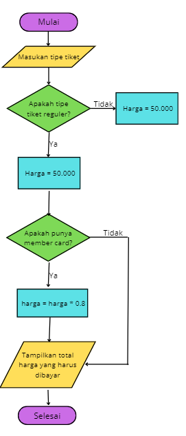

# labpy02

- Nama : Roufan Awaluna Romadhon
- NIM : 31210423
- Kelas : TI.24.A.3

---

## 1. Program Pemesanan Tiket Bioskop

### Deskripsi Program:
Program ini menghitung harga tiket bioskop berdasarkan tipe tiket yang dipilih pengguna (reguler atau VIP) dan status member pengguna. Jika pengguna adalah member, mereka akan mendapatkan diskon 20% dari harga tiket.

### Kode Program
Kode program dapat dilihat dibawah ini atau buka file ini [`PesanTiketBioskop.py`](PesanTiketBioskop.py).
```python
# Kasus 1: Program Pemesanan Tiket Bioskop

# Input user
tipe_tiket = input("Masukkan tipe tiket (reguler/VIP): ").lower()
is_member = input("Apakah Anda memiliki kartu member? (ya/tidak): ").lower()

# Harga tiket
harga_reguler = 50000
harga_vip = 100000

# Tentukan harga tiket
harga_tiket = harga_reguler if tipe_tiket == 'reguler' else harga_vip

# Jika member, berikan diskon 20%
if is_member == 'ya':
    harga_tiket *= 0.8  # diskon 20%

# Tampilkan total harga
print(f"Total harga yang harus dibayar: Rp{int(harga_tiket)}")
```

### Penjelasan Program:
1. Pengguna diminta untuk memilih tipe tiket: **reguler** (Rp50.000) atau **VIP** (Rp100.000).
2. Pengguna juga diminta untuk menyatakan apakah mereka memiliki kartu member atau tidak.
3. Jika pengguna memiliki kartu member, mereka mendapatkan diskon 20%.
4. Program menghitung total harga tiket berdasarkan tipe tiket dan status member.
5. Program menampilkan total harga tiket yang harus dibayar oleh pengguna.

### Flowchart:
Flowchartnya adalah sebagai berikut:



### Screenshot Hasil Eksekusi Program:
Berikut adalah hasil eksekusi programnya:


---

## 2. Program Kalkulator Sederhana

### Deskripsi Program:
Program ini adalah kalkulator sederhana yang menerima dua angka dan satu operator aritmatika dari pengguna (penjumlahan, pengurangan, perkalian, atau pembagian). Program akan menghitung hasil sesuai dengan operator yang dipilih oleh pengguna.

### Kode Program
Kode program dapat dilihat dibawah ini atau buka file ini [`Kalkulator.py`](Kalkulator.py).
```python
# Kasus 2: Program Kalkulator Sederhana

# Input user
angka1 = float(input("Masukkan angka pertama: "))
angka2 = float(input("Masukkan angka kedua: "))
operator = input("Masukkan operator (+, -, *, /): ")

# Operasi aritmatika berdasarkan input
if operator == '+':
    hasil = angka1 + angka2
elif operator == '-':
    hasil = angka1 - angka2
elif operator == '*':
    hasil = angka1 * angka2
elif operator == '/':
    if angka2 != 0:
        hasil = angka1 / angka2
    else:
        hasil = "Tidak bisa membagi dengan nol"
else:
    hasil = "Operator tidak valid"

# Tampilkan hasil
print(f"Hasil: {hasil}")
```

### Penjelasan Program:
1. Pengguna diminta memasukkan dua angka.
2. Pengguna diminta memilih salah satu operator aritmatika: **+**, **-**, **\***, atau **/**.
3. Program melakukan operasi sesuai dengan operator yang dipilih.
4. Jika operator adalah pembagian, program mengecek apakah pembagian dengan nol dilakukan. Jika ya, program menampilkan pesan error.
5. Program menampilkan hasil perhitungan atau pesan error jika input tidak valid.

### Flowchart:
Flowchartnya adalah sebagai berikut:


### Screenshot Hasil Eksekusi Program:
Berikut adalah hasil eksekusi programnya:

